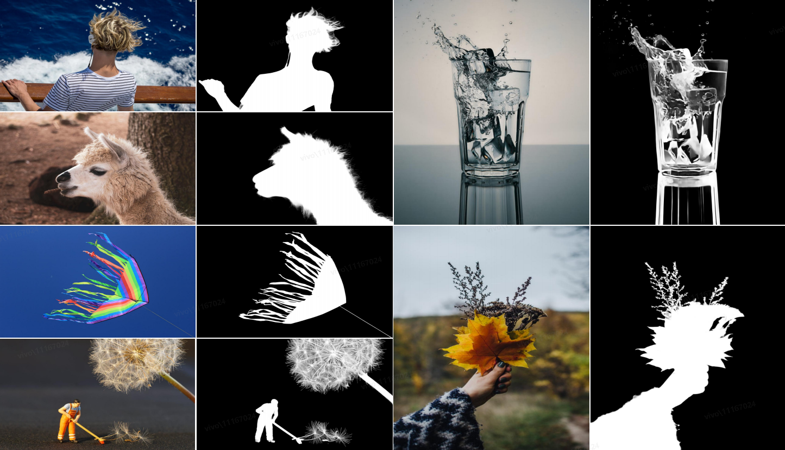
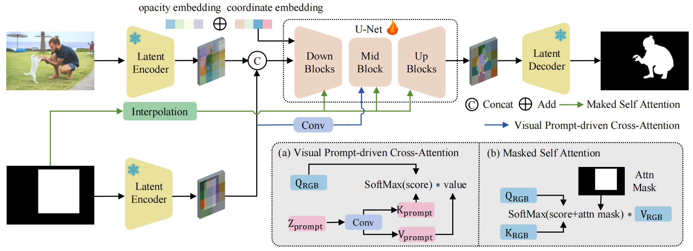
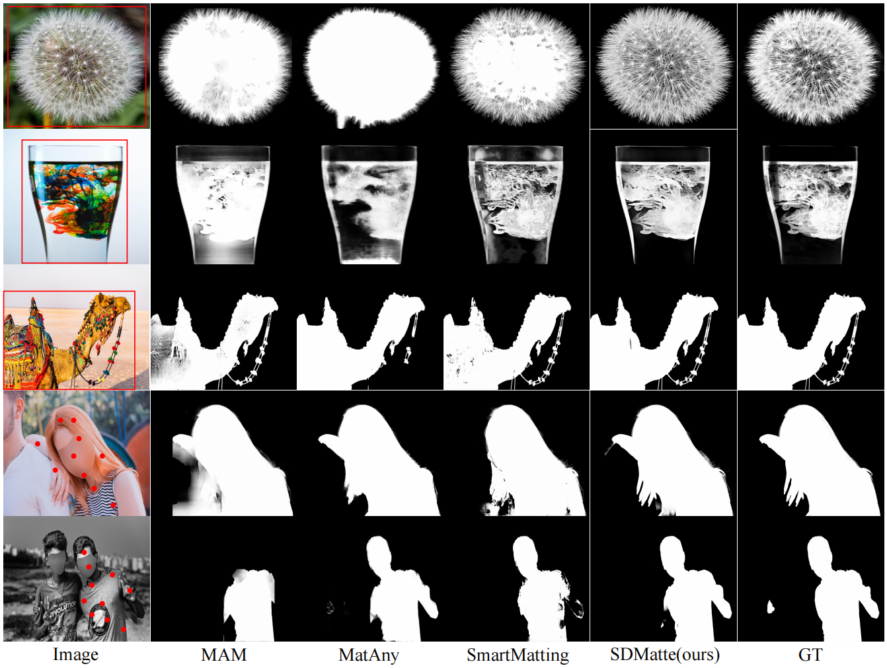

<div align="center">
<div id="SDMatte" style="text-align: center;">
    
    <h2>Grafting Diffusion Models for Interactive Matting</h2>
</div>

<p align="center">
<b>
<a href="https://github.com/LongfeiH">Longfei Huang</a><sup>1,2*</sup>, 
<a href="https://github.com/liangyufz">Yu Liang</a><sup>2*</sup>, 
<a href="https://scholar.google.com/citations?hl=zh-CN&user=DwzGTQsAAAAJ">Hao Zhang</a><sup>2</sup>, 
<a href="https://scholar.google.com/citations?user=85QJ_i4AAAAJ&hl=zh-CN">Peng-Tao Jiang</a><sup>2†</sup>
</b>
</p>

<p align="center">
<sup>1</sup> Shanghai University &nbsp;&nbsp;&nbsp;&nbsp; <sup>2</sup> vivo Mobile Communication Co., Ltd.
</p>

<p align="center">
<sup>*</sup> equal contribution &nbsp;&nbsp;&nbsp;&nbsp; <sup>†</sup> corresponding author
</p>

[](LINK)
[](LICENSE)
[](LINK)

<strong>SDMatte is an interactive image matting method based on stable diffusion, which supports three types of visual prompts—points, boxes, and masks—for accurately extracting target objects from natural images.</strong>

<div style="width: 100%; text-align: center; margin:auto;">
    
</div>


</div>

## Contents
- [Introduction](#introduction)
- [Installation](#installation)
- [Dataset](#dataset)
- [Pretrained Model](#pretrained-model)
- [Test](#test)

## Introduction
### Abstract

Recent interactive matting methods have demonstrated satisfactory performance in capturing the primary regions of objects, but they fall short in extracting fine-grained details in edge regions. Diffusion models trained on billions of image-text pairs, demonstrate exceptional capability in modeling highly complex data distributions and synthesizing realistic texture details, while exhibiting robust text-driven interaction capabilities, making them an attractive solution for interactive matting. 
To this end, we propose SDMatte, a diffusion-driven interactive matting model, with three key contributions.
First, we exploit the powerful priors of the pre-trained U-Net within diffusion models and transform the text-driven interaction mechanism into a visual prompt-driven interaction mechanism to enable interactive matting.
Second, we integrate coordinate embeddings of visual prompts and opacity embeddings of objects into U-Net, enhancing SDMatte's sensitivity to spatial position information and opacity information.
Third, we propose a masked self-attention mechanism and a visual prompt-driven interaction mechanism that enable the model to focus on areas specified by visual prompts, leading to better performance.
Extensive experiments on multiple datasets demonstrate the superior performance of our method, validating its effectiveness in interactive matting.

### Architecture

<div align="center">
  
</div><br/>

### Visualization

<div align="center">
  
</div>

## Installation

* Create a conda virtual env and activate it.

  ```
  conda create -n SDMatte python==3.10
  conda activate SDMatte
  ```
* Install packages.

  ```
  cd path/to/SDMatte
  pip install -r requirements.txt
  ```
* Install [detectron2](https://github.com/facebookresearch/detectron2) , follow its [documentation](https://detectron2.readthedocs.io/en/latest/).
  For SDMatte, we recommend to build it from latest source code.
  ```
  python -m pip install 'git+https://github.com/facebookresearch/detectron2.git'
  ```

## Dataset

* You should prepare [Composition-1K](https://sites.google.com/view/deepimagematting), [DIS-646](https://github.com/yuhaoliu7456/CVPR2020-HAttMatting), [AM-2K](https://github.com/JizhiziLi/GFM), [UHRSD](https://github.com/iCVTEAM/PGNet), [RefMatte](https://github.com/jizhiziLi/rim) and [BG-20K](https://github.com/JizhiziLi/GFM) dataset for training SDMatte and LiteSDMatte.

* You should prepare [Composition-1K](https://sites.google.com/view/deepimagematting), [DIS-646](https://github.com/yuhaoliu7456/CVPR2020-HAttMatting), [AM-2K](https://github.com/JizhiziLi/GFM), [COCO-Matte](https://github.com/XiaRho/SEMat) and [BG-20K](https://github.com/JizhiziLi/GFM) dataset for training SDMatte<sup>*</sup>.


* Check lines 15–56 and 529–530 in `SDMatte/data/dataset.py` to modify the data path to your data path.

## Pretrained Model

* Get [Stable Diffusion v2](https://huggingface.co/stabilityai/stable-diffusion-2) as pretrained weigth of SDMatte and SDMatte<sup>*</sup>.

* Get [BK SDM v2](https://huggingface.co/nota-ai/bk-sdm-v2-base) and [Tiny VAE](https://huggingface.co/madebyollin/taesd) as pretrained weigth of LiteSDMatte.

* Add the following settings to `unet/config.json`.
  ``` 
  "bbox_time_embed_dim": 320,
  "point_embeddings_input_dim": 1680,
  "bbox_embeddings_input_dim": 1280,
  ```
* Run `process_weight.py` to perform the necessary processing on the pretrained weights.
* In `configs/SDMatte.py`, replace the path at line 30 with your pretrained weights path.


## Test

* Replace line 22 in `configs/SDMatte.py` or `configs/LiteSDMatte.py` with the path to your trained weights, and then run `bash script/test.sh` to test.